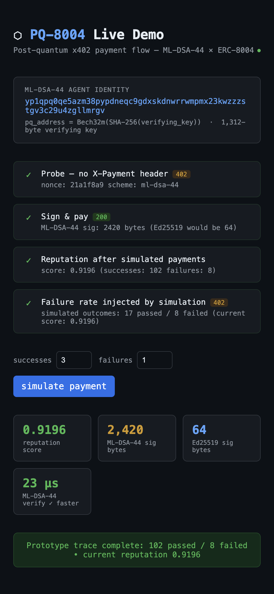

# PQ-8004

Local proof-of-concept for post-quantum agent identity and x402-style payment verification.

> Prototype status: research demo, not production, not security-audited.

## What it is

- ML-DSA-44 agent identity and signing
- local challenge/response payment flow inspired by x402
- simple reputation tracking
- replay protection and failed-payment handling

## Run it

```bash
cargo run -p demo
```

Open:

```text
http://127.0.0.1:3742
```

## Screenshot



## License

MIT OR Apache-2.0
