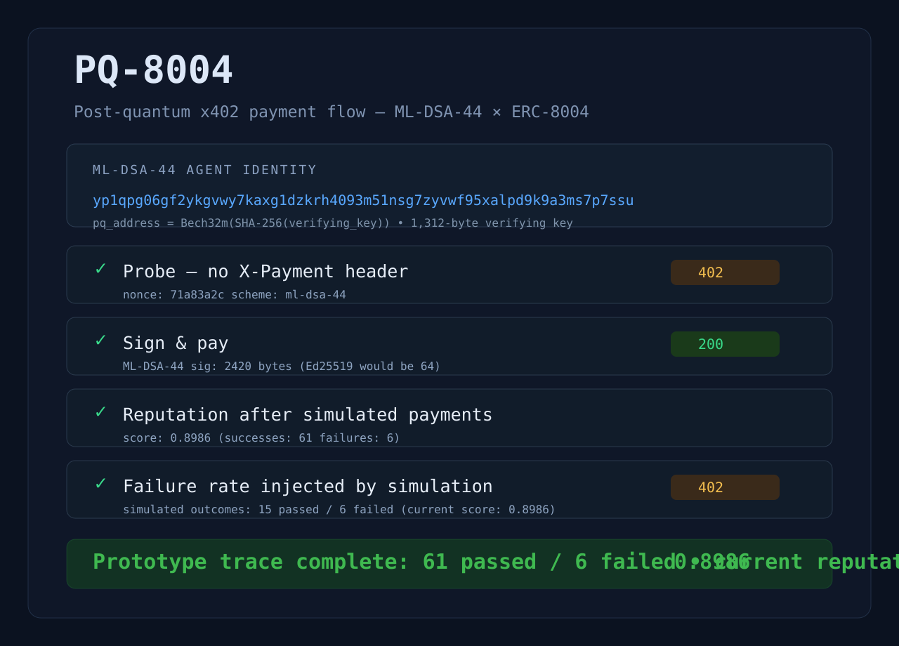

# PQ-8004

Local proof-of-concept for post-quantum agent identity and x402-style payment verification.

> Prototype status: this is a lightweight research demo, not a production system and not security-audited.

## What it shows

- ML-DSA-44 agent identity and signing
- a local challenge/response payment flow inspired by x402
- basic reputation tracking
- replay protection and failed-payment handling

## Run locally

```bash
cargo run -p demo
```

Then open:

```text
http://127.0.0.1:3742
```

## Why this exists

This project is a small execution trace for a post-quantum identity/payment pattern. The goal is to show the flow clearly on a single machine:

- challenge issued when no payment header is present
- agent signs a payment intent with ML-DSA-44
- server verifies the signature and records reputation
- replayed payment attempts are rejected

## Screenshot



## License

MIT OR Apache-2.0
