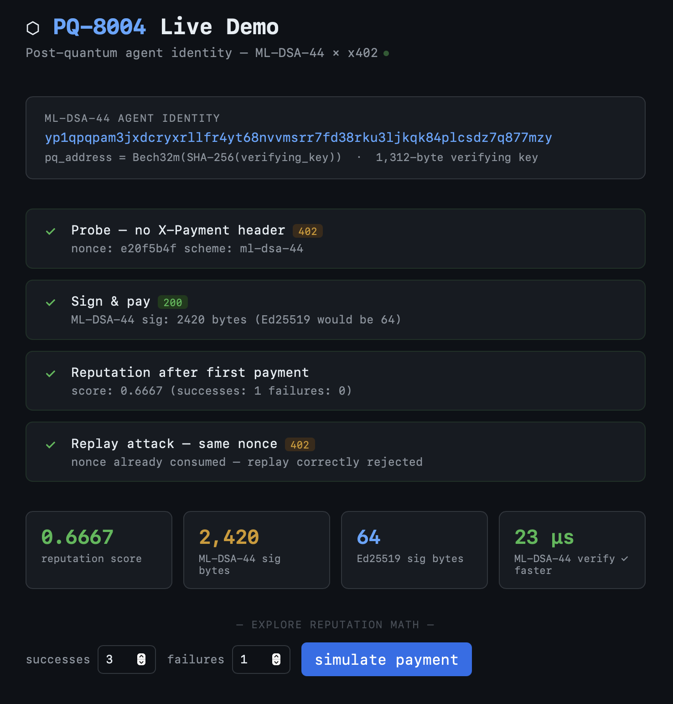

# PQ-8004

> ML-DSA-44 verification is faster than Ed25519 — 23 µs vs 24.7 µs. The cost is signature size (2,420 bytes vs 64), not compute.

Proof-of-concept for post-quantum agent identity and payment verification. Today's agent identity relies on ECDSA and Ed25519 — the same cryptography quantum computers will eventually break. This explores what the identity layer looks like built on ML-DSA-44 (FIPS 204, NIST-standardized) from the start.

> Prototype status: research demo, not production, not security-audited.

## How it works

**Identity** — each agent generates an ML-DSA-44 keypair. The public key is hashed and encoded as a Bech32m `pq_address` (`yp1...`). No central authority issues it.

**Payment** — HTTP 402 challenge/response. The server issues a challenge with a one-time nonce; the agent signs a payment intent with their private key; the server verifies the signature and grants access.

**Reputation** — each payment outcome updates a Bayesian score with time decay: `score = [(s+1)/(s+f+2)] × e^(−λ × days_idle)`. New agents start at 0.5.

## Run it

Requires [Rust](https://rustup.rs).

```bash
cargo run -p demo
```

Opens at `http://127.0.0.1:3742`

## Screenshot



## Roadmap

- [ ] on-chain reputation registry
- [ ] multi-party feedback signals beyond payment outcomes
- [ ] ML-DSA-44 precompile EIP (required for on-chain signature verification)
- [ ] MCP server — expose identity and reputation as agent tools
- [ ] A2A AgentCard — advertise pq_address and supported trust types

## License

MIT OR Apache-2.0
